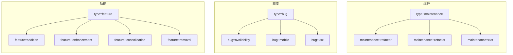
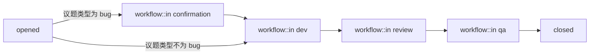
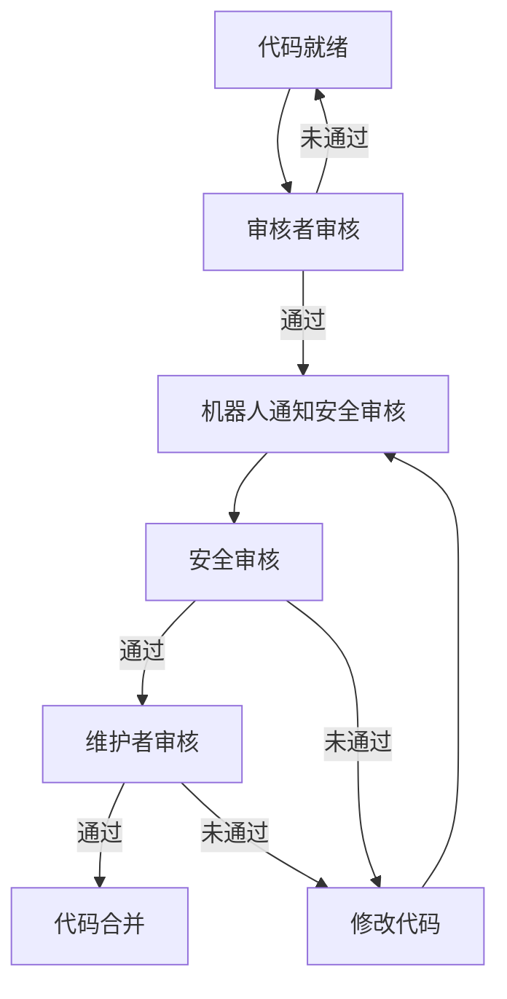

本文会先介绍研发效率相关的背景，然后会分享极狐团队的具体实践，最后会做总结以及展望一下机器人产品的理想形态。

## 背景

研发效率对互联网/科技类公司来说至关重要，效率高意味着你能用更低的人力、时间成本在市场试错，你成功的概率会更大。

而说到研发效率的常见阻碍，主要有两点：

1. 研发流程中需要大量人工决策介入，带来了高度的不确定性，导致无法形成清晰简单的流程规范。
2. 研发流程中出现大量重复冗余的工作，增加了工作量。

首先确定好研发流程规范，然后逐步分析识别需要人工决策和大量重复冗余的步骤，尝试使用自动化程序代替，这个就是极狐研发团队提升研发效率的探索方向。极狐研发团队当前主要维护着两个机器人项目：[Triage Ops](https://jihulab.com/gitlab-cn/quality/triage-ops) 和 [Danger Bot](https://jihulab.com/gitlab-cn/gitlab/-/tree/main-jh/jh/danger)，下面我会详细讲解我们是如何通过机器人来提升研发效率的。

## 极狐团队实践

### 一、自动化议题的组织与分类

| 自动化之前 | 自动化之后 |
|-------|-------|
|  |  |

议题清晰的分类标记对处理效率很有帮助，在机器人自动化处理之前，基本要靠人工来识别和提醒。我们在处理议题分类的自动化时，先是为议题(Issue)做了很详细的分类（使用 GitLab 标记功能）：

然后在流程上做出一些约定：

1. 每个议题都应该有个分类标记，方便快速定位处理人。
2. feature 和 maintenance 这两类议题需要明确指定下一级分类。

最后，我们开发以下功能，整个议题的自动化处理就完成了：

1. 对于规范要求的 “每个议题都应该有个分类标记”，我们开发了一个机器人提醒功能，对每个符合条件的议题做出提醒。
2. 对于 “feature 和 maintenance 这两类议题需要明确指定下一级分类”，我们也开发了一个机器人提醒功能，对符合条件的类型标记做出进一步的提醒。
3. 之前有人认为如果直接指定一个二级标记，那么应该自动帮我们补全他的一级标记，而且不应该再提醒需要类型标记，这个我们也实现了。

### 二、自动化议题的工作流转

| 自动化之前 | 自动化之后 |
|-------|-------|
|  |  |

议题的工作流转情况有很多，在自动化之前，我们需要全部手动判断处理，容易出错。在自动化之后一切都变得轻而易举。

实现极狐议题自动化流转，首先我们增加了四个 workflow 标记来区分不同阶段状态（GitLab 议题原生的状态只有 opened 和 closed 两种，不够区分），以下是完整的状态流转图：

接下来，我们开发了这些功能来让研发过程中的议题流转变得自动化：

1. 自动为 bug 类型议题打上 `workflow::in confirmation` 标记，并自动分配给 QA 工程师处理。保证每个 bug 处理前需要先被复现，这也是保证验收合格的前提。
2. 当议题指派给 DEV 角色时，自动给议题打上 `workflow::in dev` 标记，表示已经进入开发阶段。
3. 当议题关联的合并请求准备就绪(Ready)时，自动给议题打上 `workflow::in review` 标记，表示已经进入代码审核阶段。
4. 当议题指派给 QA 角色时，自动给议题打上 `workflow::in qa` 标记，表示已经进入 QA 验收阶段。

我们的合并请求的状态流转也实现了自动化，不过它跟议题的状态很类似，这里不在赘述。

### 三、自动化代码的审核流程

| 自动化之前 | 自动化之后 |
|-------|-------|
|  |  |

代码的审核(review)在研发过程是很耗时的，提高审核效率能直接为研发周期节省很多时间。

极狐研发流程规范里，为代码审核添加了“安全审核”的步骤，保证代码进入主分支前没有安全隐患，以下是极狐完整的代码审核流程：

在自动化之前，我们的安全审核全靠手动找人和沟通，而在自动化之后机器人会自动做提醒推动流程，且整个过程也会详细记录下来，方便追溯。我们安全审核机器人的逻辑是：

1. 当代码审核者审核第一次通过时，机器人会通知一名安全审核者来做安全审核，并打上 `security-review::pending` 标记。
2. 安全审核通过时，机器人会自动修改标记为 `security-review::approved`，维护者可以根据这个标记状态判断是否已经完成安全审核。
3. 当代码再次被修改时，机器人会自动撤销安全审核结果重新打上 `security-review::pending` 标记，并且通知上次的安全审核者再做一次安全审核。

最后，整个安全审核流程就基本被自动化了。另外代码审核还有一个需要解决的问题，是如何选择“审核者”和“维护者”。对此我们开发了以下功能：

1. 首先对每个合并请求进行分析归类，常见的类型有：Backend, Frontend, QA, Document 等，可能同时符合多个类别。
2. 机器人自动为合并请求打上对应的类别标记，比如如果代码同时修改了前后端代码，就同时打上 Backend, Frontend 两个标记。
3. 机器人生成一条“审核者推荐”的评论，为每个类别进行“审核者”和“维护者”推荐，推荐算法会根据员工的状态（请假、忙碌、主动状态）和员工与代码的关联程度进行打分，优先推荐最高分： 
    

“安全审核” 和 “审核者推荐” 两个问题都解决后，代码审核工作基本就已经实现自动化了。

### 四、自动化里程碑的过渡

| 自动化之前 | 自动化之后 |
|-------|-------|
|  |  |

极狐研发团队的里程碑周期是每个月18号到下个月17号：
    

每次里程碑过渡，我们都会有这两类固定工作需要处理：

1. 每个里程碑都有两个重要会议 “Planning 会议” 和 “Retro 会议”，在 “Planning 会议” 之前我们研发同事需要完成工作余量的评估，而在 “Retro 会议” 之前我们研发同事需要总结这个里程碑做的好的以及待改进的点。这些提醒每个里程碑会发生几次，简单重复，因此我们开发机器人功能，自动在固定时间里做出提醒。实际上程序比人更不容易遗漏和出错。
2. 议题指派到研发处理时，都应该指定好里程碑（我们的里程碑就是版本），但并不是所有议题都会正确设置里程碑，此时我们的机器人需要能够自动纠正好他们：
   - 当一个合并请求被合并却没有里程碑时，机器人会自动根据代码上线版本设置好里程碑。
   - 当一个议题在里程碑结束后仍没有被关闭时，机器人会自动延期到下个里程碑。

在完成以上两类工作后，里程碑过渡时我们需要手动处理的工作越来越少了。

### 五、自动化研发的相关报表

通过报表汇总一些数据和任务，是一种很方便的总结和提醒方式。这里实际能做的报表有很多种，比如我们极狐处理了（或计划处理）的报表有：

1. 里程碑回顾报表：分类汇总上个里程碑已完成任务和未完成任务，帮助里程碑回顾时做总结参考。
2. 需关注议题报表：按创建时间和紧急程度列出一段时间内的议题，帮助那些紧急的议题得到优先关注。
3. 需关注合并请求报表：按创建时间倒序列出一段时间内的合并请求，帮助优先关注持续时间较长的合并请求。

以上报表可以让机器人在固定的时间自动生成，帮助研发团队提升效率。

## 总结

对于研发效率的提升，我们用了五个典型例子来讲解：“议题分类”、“议题流转”、“代码审核”、“里程碑过渡”和“自动报表”，实际上能做的事情还有很多。

对于后续机器人项目形态，我期望是能将机器人项目实现成一个开箱即用的研发标准框架，即在团队中安装后，能初始化一套规范流程，定义好一些标准的议题模板、类型标记供使用，对在规范中已经确定的操作会自动通过机器人完成。另外当前的机器人还缺少智能功能，它应该可以通过简单问答主动宣传它的能力，还可以帮助研发人员推进很多常见的流程问题。

最后，我们希望极狐的机器人项目能成为一个产品帮助其他企业提升效率，如果您对极狐的机器人项目感兴趣，欢迎留言与我们交流。
