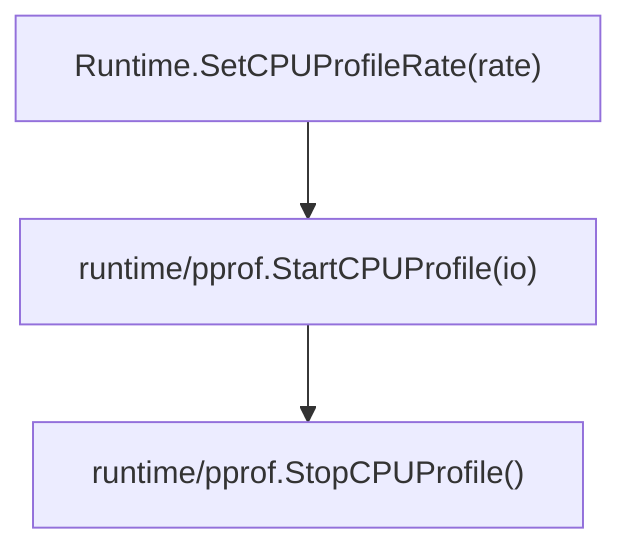
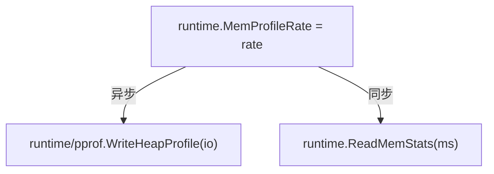
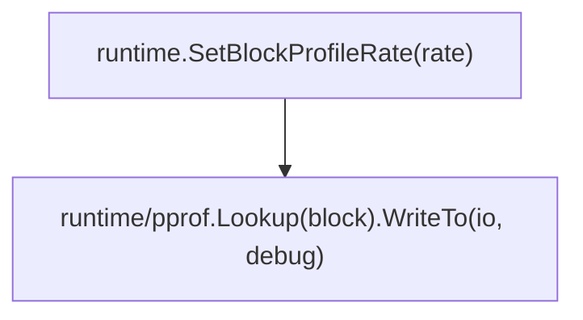

Golang 为性能检测提供了丰富的标准库和标准工具，本文会详细介绍他们的使用和原理。

## 性能检测库和工具

Golang 中提供了丰富的标准库来帮助我们配置、收集、存储性能指标信息：

| 标准库 | 主要作用 | 使用场景 |
| ----- | ------ | ------- |
| net/http/pprof | 提供开箱即用的性能指标 HTTP 接口 | 在线检测应用性能指标，供性能检测工具使用接口 |
| runtime/pprof  | 提供了一系列函数用于在程序运行时收集和输出性能分析数据 | 非网络应用的性能检测，或者需要深入控制检测逻辑 |
| runtime/trace  | 提供了一系列函数用于跟踪和分析程序执行期间性能 | 非网络应用的性能检测，或者需要深入控制检测逻辑 |
| runtime        | 提供了一系列函数用于配置性能检测参数 | 动态调整性能检测的采样率，比如配置 CPU、内存、阻塞采样频率 |

上述性能指标中的产物有些是 protocol buffers 二进制格式，Golang 提供了两个标准工具来解析它们：

| 标准工具 | 主要作用 |
| ------- | ------- |
| go tool pprof | 解析 CPU、内存、阻塞、Goroutine 等指标信息 |
| go tool trace | 解析代码运行事件和时间戳等跟踪信息 |

## 开箱即用的性能接口

标准库 net/http/pprof 可以帮我们基于 HTTP 协议的网络应用添加性能分析接口。我们只需要：

```golang
import (
    "net/http"
    _ "net/http/pprof"
)

func main() {
    // ...
    http.ListenAndServe("localhost:8082", nil)
}
```

然后就可以访问 http://localhost:8082/debug/pprof/ 得到一个简约的在线性能检测页面。我们可以在这里快速对应用进行性能检测，也可以把这里的接口地址提供给性能分析工具，例如：go tool pprof 和 go tool trace 等。

页面中总共有 9 个指标，底部有详细的指标介绍，方便我们快速了解他们的含义以及一些能用到的功能参数。需要关注的几点：
1. 指标接口都是固定的：`http://localhost:8082/debug/pprof/[metric]?debug=[1]&seconds=[10]`
1. 参数 debug: debug 是用来配置指标的调试级别的，常用值有：
    - debug=0: 指标产物以最小化的 Protobuf 二进制文件形式呈现，需要配合性能分析工具解读。例如查看 Goroutine 的指标可以这样：`go tool pprof http://localhost:8082/debug/pprof/goroutine?debug=0`
    - debug=1: 指标产物为普通文本，一般可以直接网页中打开。需要注意有些指标只有二进制文件格式（profile 和 trace），他们无法在在线查看。
    - debug=2: 指标产物也是普通文本，一般会包含更加复杂的信息
1. 参数 seconds: 配置指标检测的时间，默认 profile 为 30s, trace 为 1s

## 标准库指标详解

### CPU 指标

当我们的应用不需要网络服务，或者 net/http/pprof 的功能无法满足我们需要，此时我们就需要使用到上面列出的标准库来具体实现性能检测。

我们先来看下 CPU 指标检测（指标名称叫 profile），下面是具体的函数使用流程图：



对于流程图的函数：
- `Runtime.SetCPUProfileRate`: 设置采样频率，这个是可选步骤，单位是 Hz，默认值为100。这个参数限制最多 1M Hz，也就是最允许 1 微秒最多采样一次。扩展一下，一般当前常用的 3.2GHz 的 CPU，代表单个内核在 1 纳秒可以执行 3 条运算指令。
- `runtime/pprof.StartCPUProfile`: 启用一个新的 Goroutine 负责执行 CPU 概要信息的收集和输出，参数为一个 io 句柄
- `runtime/pprof.StopCPUProfile`: 终止 CPU 指标检测的 Goroutine。这里也会调用 SetCPUProfileRate，将参数配置成 0，停止采样工作。

### 内存指标

内存指标在上面对应是 allocs 和 heap，allocs 指标默认视角是 “已分配空间”（alloc_space），heap 默认为 “在用空间”（inuse_space）视角。

内存指标的函数使用流程图为：


说明：
- `runtime.MemProfileRate`: 设置内存的采样频率，单位为 B，默认值为 512 * 1024，代表内存满 512B 时进行一次采样。注意如果要修改该值，应该尽早设置且只设置一遍
- `runtime/pprof.WriteHeapProfile`: 将收集好的内存概要信息写入文件，参数为一个 io 句柄
- `runtime.ReadMemStats`: 实时收集内存概要信息写入文件，需要注意，该函数会引起 Go 语言调度器的短暂停顿。

### 阻塞指标

类似上面两个指标，流程图为：


说明：
- `runtime.SetBlockProfileRate`: 设置阻塞采样频率，单位为纳秒(ns)，含义为一个阻塞事件的持续时间达到了多少个纳秒就可以对其采样。
- `runtime/pprof.Lookup("block").WriteTo(io, debug)`: 获取阻塞指标信息并写入文件

### 其他指标

上面我们可以看到收集阻塞指标信息跟 CPU 和内存不同，用到了更通用的查找和写入方法。其中 `Lookup` 函数用于获取具体指标信息。

`Lookup` 函数除了获取阻塞指标，还能获取其他指标。这些指标跟 net/http/pprof 页面中提供的指标一致，参考下图：


## 总结

以上就是 Golang 性能检测的完整介绍，以下是汇总的导图：


## 扩展阅读

- [Go语言核心36讲](https://time.geekbang.org/column/intro/112)
- [net/http/pprof](https://golang.org/pkg/net/http/pprof/)
- [runtime/pprof](https://golang.org/pkg/runtime/pprof/)
- [runtime/trace](https://pkg.go.dev/runtime/trace)
- [runtime](https://golang.org/pkg/runtime/)
