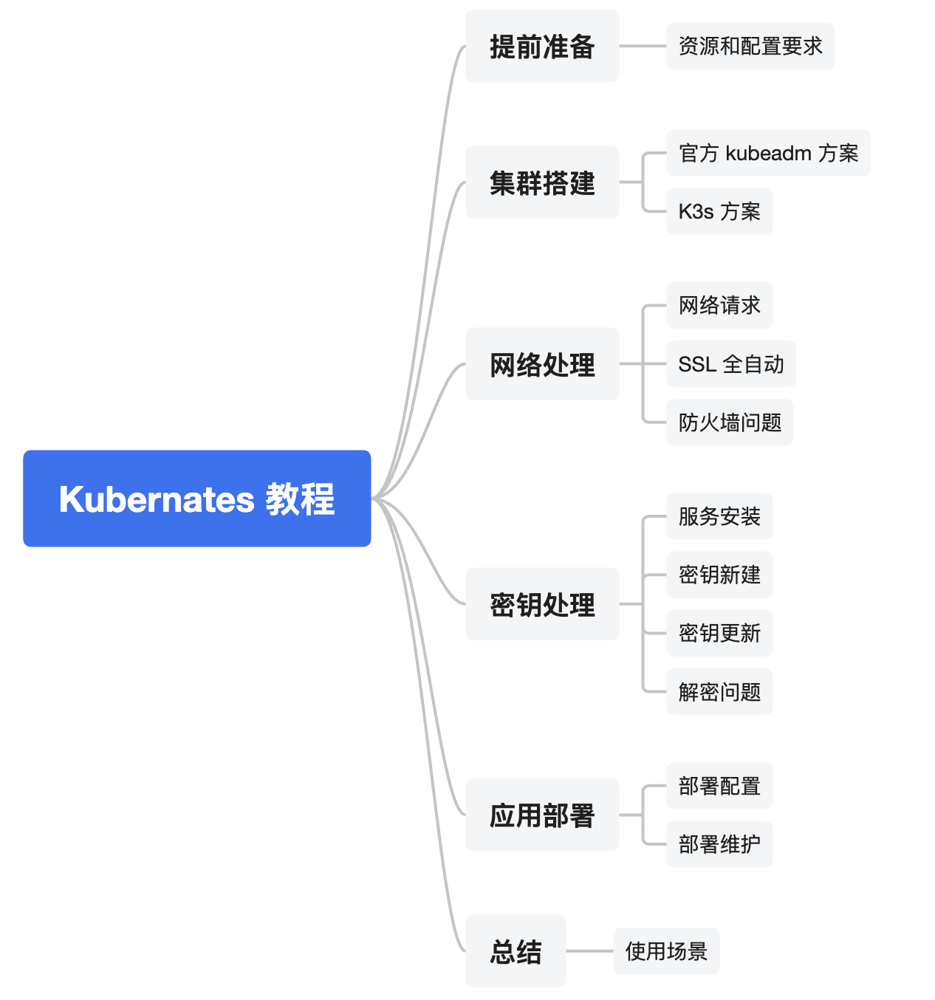

本文从零开始搭建一个 Kubernates 集群，并在集群上部署一个带数据存储、HTTPS 域名访问的 [博客站点](https://kubernates-tutorial.hdgcs.com)。搭建完这套系统之后，我们再部署其他应用就会变得轻而易举了。

先附上教程整体大纲：


## 提前准备

国内技术领域 80% 的问题都源于网络，因此我们需要准备一台海外云主机，这直接省去了各种资源下载失败、域名备案等一些列烦恼。具体资源情况：
- 海外云主机，推荐香港
- 数量：至少 1 台，推荐 3 台
- 配置：至少 2C4G，推荐 4C8G

对于每个节点机器，需要保证端口可用，比如配置好云厂商网络安全以及机器的防火墙：


## 集群搭建

### 官方 kubeadm 方案

我们可以参照官方 [使用 kubeadm 创建集群](https://v1-31.docs.kubernetes.io/zh-cn/docs/setup/production-environment/tools/kubeadm/create-cluster-kubeadm/) 文档搭建一个全功能的生产集群。不过这个方案流程复杂，要想快速开始，可以选下面推荐的方案。

### K3s 方案(推荐)

K3s 是一个完全兼容的 Kubernates 发行版，会打包所有组件到一个二进制文件中，减少资源占用和安装维护复杂度。一条命令实现安装当初直接惊艳到我了，好产品就应该做到如此啊。

```
# master 节点安装
curl -sfL https://get.k3s.io | INSTALL_K3S_VERSION=v1.31.6+k3s1 sh -

# worker 节点安装
curl -sfL https://get.k3s.io | INSTALL_K3S_VERSION=v1.31.6+k3s1 K3S_URL=https://myserver:6443 K3S_TOKEN=mynodetoken sh -

# master 节点卸载
/usr/local/bin/k3s-uninstall.sh

# worker 节点卸载
/usr/local/bin/k3s-agent-uninstall.sh
```

- 上面 master 就是主节点，如果你有多台机器，这个就是以后管理 K8s 集群的那台
- worker 节点的 K3S_URL 配置的 myserver 可以直接用 master 内网 IP，K3S_TOKEN 位于 master 机器 `/var/lib/rancher/k3s/server/node-token`

#### (可选) 配置不需要 sudo 访问

```
# 配置不需要 sudo 使用
mkdir -p $HOME/.kube
sudo cp -i /etc/rancher/k3s/k3s.yaml $HOME/.kube/config
sudo chown $(id -u):$(id -g) $HOME/.kube/config

echo 'export KUBECONFIG=$HOME/.kube/config' >> ~/.bashrc
source ~/.bashrc

# 在不加载 .bashrc 的环境还需要
sudo chmod +r /etc/rancher/k3s/k3s.yaml
```

## 网络处理

### 网络请求

首先我们来捋一下用户完整的请求流程：

```
用户 → 域名 → DNS → 节点IP:80/443 → Traefik Ingress → 后端服务
```

针对上面的过程，我们需要做的有：
- 域名 → DNS: 在域名厂商那里添加解析，建议直接用泛解析，以后新应用直接用子域名访问就可以了：`*.mydomain.com -> myserver-ip`
- DNS → 节点IP:80/443: 集群安装时已经自动完成了这两个端口的监听，如果云主机有防火墙记得打开这两个端口的外网访问
- Traefik Ingress → 后端服务: Traefik 也是集群自带的组件，我们这里要做的就是最后部署应用时配置好对应的 ingress 就行，见后面部署章节

如果自带的 Traefik 网关功能不够，可以考虑使用 [APISIX](https://apisix.apache.org/) 等第三方网关工具。

这里使用 443 即 HTTPS 的话（浏览器默认行为），需要配置域名 SSL 证书，具体见下方说明。

### SSL 全自动

我们以后会在 Kubernates 集群部署多个应用，对应多个域名，如果像传统 Nginx 方式一样每个域名去申请 SSL 证书再挨个配置，就太麻烦了。因此需要全自动完成整个 HTTPS 访问过程，包括未来新增的域名。 

1. 安装 cert manager:
    ```
    kubectl apply -f https://github.com/cert-manager/cert-manager/releases/download/v1.17.1/cert-manager.yaml
    # 验证安装
    kubectl get pods -n cert-manager
    ```
2. 安装 ClusterIssuer:
    ```bash
    # cluster-issuer.yaml
    apiVersion: cert-manager.io/v1
    kind: ClusterIssuer
    metadata:
      name: letsencrypt-prod
    spec:
      acme:
        email: your-email@example.com  # 替换为你的邮箱
        server: https://acme-v02.api.letsencrypt.org/directory
        privateKeySecretRef:
          name: letsencrypt-prod
        solvers:
          - http01:
              ingress:
                class: traefik  # 指定使用的 Ingress 控制器类型
    ```

    ```
    kubectl apply -f cluster-issuer.yaml
    # 验证
    kubectl describe clusterissuer letsencrypt-prod
    ```

以上就是初始化需要做的，后面对于每个要部署的应用，直接添加一个 ingress 配置指定好对应域名和路由规则，即可完成整个请求的 SSL 证书申请和访问。

下面给出个使用了上述组件的示例 ingress，这个放到应用部署中来做就行，这里仅展示他们的关联：
```yaml
apiVersion: traefik.containo.us/v1alpha1
kind: Middleware
metadata:
  name: https-redirect
  namespace: myapp
spec:
  redirectScheme:
    scheme: https
    permanent: true
---
apiVersion: networking.k8s.io/v1
kind: Ingress
metadata:
  namespace: myapp
  name: nginx-ingress
  annotations:
    cert-manager.io/cluster-issuer: letsencrypt-prod # 引用 ClusterIssuer，与上方对应
    traefik.ingress.kubernetes.io/router.middlewares: myapp-https-redirect@kubernetescrd
spec:
  ingressClassName: traefik
  tls:
    - hosts:
        - myapp.mydomain.com  # 请替换你应用的域名
      secretName: tls-secret
  rules:
    - host: myapp.mydomain.com
      http:
        paths:
          - path: /
            pathType: Prefix
            backend:
              service:
                name: myservice
                port:
                  number: 80
```

### 防火墙问题

创建集群时，会添加 iptables 规则，如果一开始没有指定 bind_address，后面变更的话，会导致 iptables 规则不对

```bash
# 在另一个节点执行端口访问，确定网络不通
ubuntu@amd1:~telnet 10.0.0.106 6443
Trying 10.0.0.106...
telnet: Unable to connect to remote host: No route to host

# 清除 iptables 规则
sudo iptables -L
sudo iptables -F  # 清空所有规则链 ‌:ml-citation{ref="1" data="citationList"}
sudo iptables -X  # 删除自定义链 ‌:ml-citation{ref="1" data="citationList"}
sudo iptables -P INPUT ACCEPT  # 设置默认策略为允许所有入站流量 ‌:ml-citation{ref="1" data="citationList"}
sudo iptables -P FORWARD ACCEPT
sudo iptables -P OUTPUT ACCEPT

# 确保没有规则
sudo iptables -L

# 如果云厂商有网络安全配置，你可以选择彻底卸载 iptables。但是要注意必须先清除完规则再卸载，直接卸载当前不会生效
sudo apt remove -y iptables
```

## 密钥处理

Kubernates 的密钥是敏感对象，直接在代码仓库中存储不安全，直接在服务器中处理的话会造成部署不便，无法使用 GitOps 的便利。

这里我们可以引入一个非对称加密流程，这样就可以所有加密后的密钥对象直接存储在代码仓库，部署后服务器上会自动通过私钥解密出真实密钥对象。这个流程当前已经有开源库 [bitnami-labs/sealed-secrets](https://github.com/bitnami-labs/sealed-secrets) 实现了。

### 服务安装

1. 在服务器安装服务端：
    ```bash
    kubectl apply -f https://github.com/bitnami-labs/sealed-secrets/releases/download/v0.28.0/controller.yaml

    # 存储公钥和私钥，开发环境后面需要
    kubectl get secret -n kube-system -l sealedsecrets.bitnami.com/sealed-secrets-key -o yaml
    echo -n '$tls.crt' | base64 --decode > public.crt # 存储到代码仓库中
    echo -n '$tls.key' | base64 --decode > private.key # 管理员单独保存，记得添加 .gitignore 防止不小心公开
    ```
1. 在开发环境安装客户端：
    ```bash
    # macOS 系统
    brew install kubeseal

    # Linux 系统
    KUBESEAL_VERSION='0.28.0' # Set this to, for example, KUBESEAL_VERSION='0.23.0'
    curl -OL "https://github.com/bitnami-labs/sealed-secrets/releases/download/v${KUBESEAL_VERSION:?}/kubeseal-${KUBESEAL_VERSION:?}-linux-arm64.tar.gz"
    tar -xvzf kubeseal-${KUBESEAL_VERSION:?}-linux-arm64.tar.gz kubeseal
    sudo install -m 755 kubeseal /usr/local/bin/kubeseal
    ```

### 密钥新建

1. 对密文进行 base64 编码
    ```bash
    echo -n 'mypassword' | base64 -w0  # -w0 保留原始文本不自动换行
    ```
1. 创建普通 secret 对象
    ```
    cat <<EOF >./app-secret.yaml
    apiVersion: v1
    kind: Secret
    metadata:
      name: mysecret
      namespace: myapp
    type: Opaque
    data:
      password: bXlwYXNzd29yZA==
    EOF
    ```
1. 加密
    ```
    kubeseal --format=yaml --cert=public.crt < app-secret.yaml > app-sealed-secret.yaml
    ```

### 密钥更新

**注意：更新需要解密当前集群的密钥，只有有私钥的管理员能操作。**

1. 解密：
    ```
    kubeseal --format=yaml --recovery-unseal --recovery-private-key private.key -f app-sealed-secret.yaml > app-secret.yaml
    ```
1. 编辑更新原始密钥
1. 重新加密保存
    ```
    kubeseal --format=yaml --cert=public.crt < app-secret.yaml > app-sealed-secret.yaml
    ```

### 解密问题

我们可能会遇到应用 sealedsecret 之后，没有创建对应 secret，controller 日志报错：

```
E0303 09:32:40.318645       1 controller.go:282] "Unhandled Error" err="no key could decrypt secret (password)" logger="UnhandledError"
time=2025-03-03T09:32:40.318Z level=INFO msg="Event(v1.ObjectReference{Kind:\"SealedSecret\", Namespace:\"wordpress\", Name:\"mysql-pass\", UID:\"854083f1-fda7-4c9e-8ca7-2423563ad402\", APIVersion:\"bitnami.com/v1alpha1\", ResourceVersion:\"2444\", FieldPath:\"\"}): type: 'Warning' reason: 'ErrUnsealFailed' Failed to unseal: no key could decrypt secret (password)"
```

原因可能是用了 kustomization，kustomization 会修改资源 namespace，但是 kubeseal 使用的是默认空间加密，最后会导致在 kustomization 命名空间解密失败。

解决的话统一在 secret 文件中显示指定命名空间与 kustomization 里配置的一致。

## 应用部署

我们部署的应用是一个外网可访问的 [WordPress 网站](https://kubernates-tutorial.hdgcs.com/)，完整配置文件见 [songhuangcn/kubernates-tutorial](https://github.com/songhuangcn/kubernates-tutorial)。

### 部署配置

大致配置如下：

```
├── .gitignore
├── Makefile
├── config
│   ├── sealed-secret.crt
│   └── sealed-secret.key # 不存在 git 中
└── deploy
    ├── app-sealed-secret.yaml
    ├── app-secret.yaml # 不存在 git 中
    ├── ingress.yaml
    ├── kustomization.yaml
    ├── mysql.yaml
    └── wordpress.yaml
```

secret 对象配置见上面密钥处理章节, mysql 和 wordpress 对象配置可以直接参考官方 [示例：使用持久卷部署 WordPress 和 MySQL](https://v1-31.docs.kubernetes.io/zh-cn/docs/tutorials/stateful-application/mysql-wordpress-persistent-volume/)

ingress 对象中的 Middleware 是为了实现 HTTP -> HTTPS 跳转，其中域名换成你应用的即可，其他配置项都保持跟网络搭建章节里的一致。

部署流程就是更新配置到服务器中，然后在服务器上执行：
```bash
kubectl -n myapp apply -k deploy
```

如果你需要更强大的部署功能，可以考虑 [Argo CD](https://argo-cd.readthedocs.io/)

### 部署维护

以下是我常用的一些维护命令。

#### 设置默认命名空间

```bash
# 创建应用命名空间
kubectl create namespace myapp

# 查看当前上下文
kubectl config get-contexts

# 设置默认命名空间
kubectl config set-context --current --namespace=<target-namespace>

# 验证配置
kubectl config view | grep namespace
```

#### 获取密钥原文

```bash
# 需要开启自动解密
kubectl get secret <secret-name> -n <namespace> -o yaml
echo -n "<base64-encoded-value>" | base64 --decode
```

#### 临时停用服务

```bash
kubectl scale deployment --all --replicas=0
kubectl scale deployment/mysql --replicas=0
```

#### 使用私有镜像

如果你应用的镜像是私有的，比如 GitLab Registry，需要为服务添加一下授权：
1. 为项目创建一个部署令牌：**项目 > 设置 > 仓库 > 部署令牌**，权限勾选 `read_repository`
1. 将令牌配置到密钥中
    ```bash
    # 生成镜像密钥配置
    kubectl -n myapp create secret docker-registry docker-secret --dry-run=client -o yaml --docker-server=registry.gitlab.com --docker-username=xxx --docker-password=xxx --docker-email=xxx > deploy/docker-secret.yaml

    # 加密密钥
    kubeseal --format=yaml --cert=public.crt < docker-secret.yaml > docker-sealed-secret.yaml
    ```
1. 让服务使用令牌拉取镜像
    ```yaml
    # 在 deployment 对象的 containers 同层级添加
    imagePullSecrets:
    - name: docker-secret
    ```

## 总结

Kubernates 等云原生技术不仅大大提升了软件应用的可靠性、移植性和伸缩性，能让企业的软件服务变得更经济高效。对应用部署而言，Kubernates 的声明式部署也让部署变得更简单和可靠，过去命令式的部署（deploy.sh）复杂难以维护，而现在只需要定义好服务的需求和状态，然后 Kubernates 就会处理好一切。

不过，Kubernates 门槛较高，这是网上流行的使用 K8s 部署博客的梗图：


但如果你不止一个博客应用，在大货车上堆满各种集装箱，这时他带来的维护和部署上的便利也是很有意义的。
