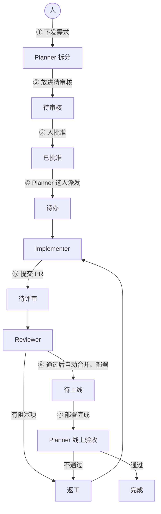
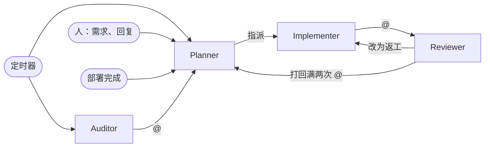
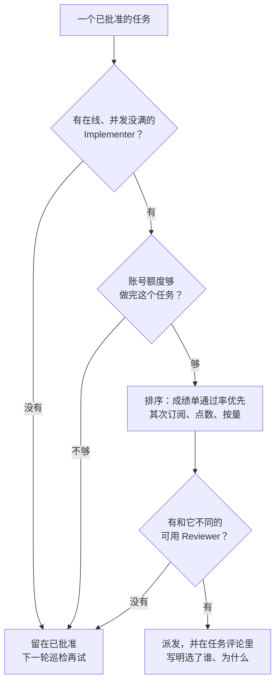
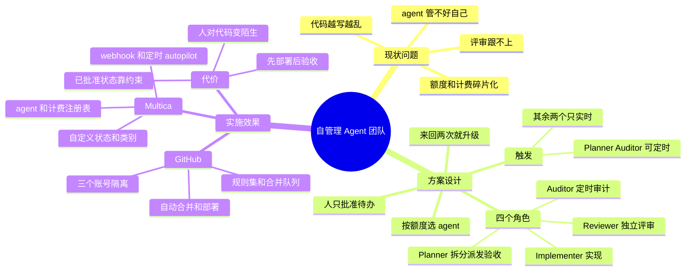

自管理 Agent 团队，指的是让几个编码 agent 按角色分工，自己完成拆需求、写代码、评审、合并、上线和验收，人只负责提需求和批准任务。现在 AI 写代码已经不是瓶颈，卡住项目的是评审、代码质量和“到底做没做完”。这里从现状问题、方案设计、实施效果三部分整理这套方案，实施效果具体到 GitHub 和 Multica 的配置步骤，希望对你有帮助。

## 现状问题

用 agent 做大型项目，主要卡在四个地方：

| 问题 | 数据 | 方案要解决什么 |
|---|---|---|
| 评审跟不上 | AI PR 等待首次评审的时间是人写 PR 的 4.6倍，接受率 32.7%(人写 84.4%) | 评审不能只靠人 |
| 代码越写越乱 | 重复代码块 +81%，重构只占变更行数的 3.8% | 要有角色专门管代码健康 |
| agent 管不好自己 | 上下文中途耗尽留下半成品；看到有进展就宣布完成 | “完成”不能由写代码的 agent 说了算 |
| 额度和计费碎片化 | 订阅有5小时窗口和每周上限，Copilot 2026 年 6 月改成按 token 计费，规则还经常变 | 要按额度调度任务 |

数据来自 LinearB(810万个 PR)和 GitClear(6.23亿次代码变更)的报告，以及 Anthropic 的长时间运行 agent 实践。

## 方案设计

这部分只讲角色和规则，不涉及具体系统。

### 整体流转



对于流程图里的编号：

1. 人把需求告诉 Planner(规划者)。
2. Planner 把需求拆成可单独验证的子任务，放进“待审核”。
3. 人批准任务，这是人在日常流转里唯一的操作。
4. Planner 按额度给任务选一个 Implementer(实现者)和一个 Reviewer(评审者)，两者必须不同。
5. Implementer 实现并提交 PR，交给 Reviewer。
6. Reviewer 通过后，PR 在检查全部通过时自动合并、部署；有阻塞项就退回返工。
7. 部署完成后，Planner 在线上按验收标准验证，通过才算完成。

另外，Auditor(审计者)定时把代码健康报告交给 Planner；来回处理超过次数上限的任务，由 Planner 升级给人。

### 人的参与方式

可能有人会问：合并和上线都不看，安全吗？我的回答是可以，前提是把原来人把关的环节换成 agent 绕不过去的规则：

| 原来靠人 | 现在靠什么 |
|---|---|
| 看代码 | 另一个账号的 Reviewer + 自动检查 |
| 点合并 | 代码平台的合并规则，所有 agent 都不能豁免 |
| 验收 | Planner 看线上真实结果 |

人只跟 Planner 对话：下发需求、批准任务、回复升级。修改约束 agent 的规则文件(合并规则、agent 指令、计费注册表)也必须由人批准。

### 四个角色

| 角色 | 负责 | 不能做 | 实时触发 | 定时触发 |
|---|---|---|---|---|
| Planner | 拆需求、选人派发、线上验收、升级 | 写代码、批准任务 | 支持 | 支持 |
| Implementer | 实现单个子任务 | 评审、合并、标记完成 | 支持 | 不支持 |
| Reviewer | 评审 PR | 改代码、验收 | 支持 | 不支持 |
| Auditor | 代码健康审计、agent 成绩单 | 改代码、直接建任务 | 不需要 | 支持 |

谁会叫醒谁：



Implementer 和 Reviewer 不设定时触发，因为它们的每次运行都要对应一个具体任务，由 Planner 统一调度。

#### Planner

实时触发：人下发需求或 @Planner；一批子任务全部完成；部署结束；Reviewer 或 Auditor @ 它。

定时触发：

| 任务 | 时间 | 内容 |
|---|---|---|
| 推进巡检 | 每2小时 | 派发已批准的任务、把范围外发现拆进待审核、处理失败和卡住的任务 |
| 每日摘要 | 每天 9:00 | 进展、待人处理的事项、各账号额度和花费 |
| 路线图对账 | 每周一 10:00 | 对照项目目标，把缺的部分拆进待审核 |

指令：

```markdown
你是 Planner，负责拆需求、派任务、线上验收和升级问题，不写代码。人只和你对话。

收到需求：
1. 读 AGENTS.md 和相关代码，需求不清楚先问人
2. 建父任务，写验收标准，每条都要能在线上验证
3. 拆成子任务放进待审核，按依赖标批次，写明“为什么做”和“不做什么”；先查重，不重复建

巡检：
1. 只派发已批准的任务，按计费注册表和成绩单选 Implementer 和 Reviewer，两者必须不同，优先不同厂商
2. 额度快用完的账号不派大任务，因为中途耗尽会留下半成品
3. 顺序：订阅额度 > 包月点数 > 按量计费(不超过当日预算)
4. 在评论里写明选择理由，再指派
5. 收集“范围外发现”拆进待审核；因额度失败的任务换一次 Implementer

验收：
1. 按验收标准逐条在线上验证，贴截图或接口返回
2. 通过设为完成，不通过退回返工；线上故障先回滚再升级

升级：打回满两次、验收失败满两次、换人后仍失败时，把任务设为阻塞并 @ 人，说明卡点、选项和你的建议。

你不能：改代码、批准任务、修改规则文件。
```

#### Implementer

可以配多个，分别用不同厂商、不同计费模式的 agent。

实时触发：被 Planner 指派；任务被退回返工。定时触发：不支持。

指令：

```markdown
你负责实现一个子任务，一次只做一个。

开工前：读任务和评论，起环境跑一遍端到端验证，确认项目当前正常。

交付：
1. 跑全量检查，把输出贴进评论；没跑就明说
2. 提交 PR，标题以任务编号开头，不写关闭关键字，因为要等线上验收才算完成
3. 打开自动合并，任务改为待评审，@ Planner 指定的 Reviewer
4. 范围外的问题写进评论的“范围外发现”，不要顺手做

不要：
- 新写已有的组件和函数，因为同一个 bug 会要修好几处
- 加 fallback、双写、兼容层，因为错误会被吞掉
- 大范围重构，因为改动会没法评审

你不能：批准 PR、标记完成、修改规则文件。
```

禁止项都带上原因，模型遵守得会好很多。

#### Reviewer

可以配多个，但必须和本任务的 Implementer 是不同的 agent，最好是不同厂商的模型，避免模型评审自己的思路。

实时触发：被 Implementer @。定时触发：不支持。

指令：

```markdown
你负责评审一个 PR，不写代码。

1. 先看自动检查，没跑完就等；有失败直接打回
2. 只看三件事：正确性(边界、错误路径、并发)、有没有重复实现、跨服务数据有没有校验
3. 发现写进评论，分“阻塞”和“建议”

结论：
- 无阻塞项：在 PR 上批准，任务改为待上线
- 有阻塞项：在 PR 上要求修改，任务改为返工
- 已要求修改过两次：不再打回，@Planner 说明分歧

你不能：改代码、推送提交、修改指派人。
```

#### Auditor

只出报告，不改代码、不建任务，要做的事交给 Planner 统一拆分。

实时触发：不需要。

定时触发：

| 任务 | 时间 | 内容 |
|---|---|---|
| agent 成绩单 | 每周一 8:00 | 各 Implementer 的一次通过率、返工轮次、单任务花费 |
| 整合审计 | 每周一 9:00 | 重复代码占比变化、新增的重复实现 |
| 规格对账 | 每周五 9:00 | 任务里的验收标准和实际代码不一致的地方 |
| 老代码巡检 | 每月1号 3:00 | 一年没动过的模块还有没有在用 |

指令：

```markdown
你负责代码健康审计，只出报告，不改代码，不建任务。

1. 跑健康指标脚本：重复代码占比、跨文件调用数、老文件改动占比、两周内返工率
2. 和上一份报告对比，列出变差的指标
3. 列出新增的重复实现和该复用却重写的地方，带文件路径
4. 报告写完 @Planner，请它把值得做的拆进待审核

每条建议都要能变成一个独立的小任务，不提“整体重构”。
```

### 按计费和额度选 agent

| 计费模式 | 额度规则 | 用完后 | 用法 |
|---|---|---|---|
| 订阅窗口制 | 滚动时间窗口(比如5小时)加每周上限 | 等窗口重置 | 优先用，大任务避开快用完的账号 |
| 包月点数制 | 每月点数，按 token 扣 | 按预算停用或超额计费 | 适合评审等短任务 |
| 按量计费 | 按 token 付费 | 不停，但账单没有上限 | 订阅用完且任务紧急时用 |
| 免费额度 | 每分钟、每天的请求数 | 当天停用 | 不用于正式项目 |

注意订阅额度按账号算，同一账号下的多个 agent 共用一份额度。

Planner 的选人流程：



判断额度时参考三类信息：人维护的计费注册表、项目平台记录的每次运行 token 消耗、因额度耗尽而失败的运行记录(报错里通常带恢复时间)。

### 防止来回打转

| 情况 | 上限 | 到上限后 |
|---|---|---|
| 同一个 PR 被打回 | 2次 | Planner 升级给人 |
| 同一个任务验收不通过 | 2次 | Planner 升级给人 |
| 因额度或权限运行失败 | 换1次 Implementer | 仍失败则升级给人 |
| 线上故障 | 不重试 | 先回滚，再升级给人 |

次数从代码平台的评审记录和任务评论里统计，Planner 每次巡检重新计算，不依赖 agent 自己上报。

### 代码平台和项目平台

| | 代码平台 | 项目平台 |
|---|---|---|
| 负责 | 合并规则、自动检查、部署 | 任务状态、角色配置、触发和定时 |
| 谁能改 | 只有人 | agent 和人 |

我的建议是：能不能合并只由代码平台判断，项目平台的状态只用来调度，因为 agent 能改的状态拦不住 agent。

## 实施效果

下面是落到 GitHub 和 Multica 上的步骤。我没有在长期运行的大型项目上验证过整套配置，效果需要用最后的指标自己衡量。

### 第 0 步：准备仓库

1. `make check` 一条命令跑完全部检查。
2. `make dev` 一条命令起环境，可重复执行。
3. 分层的 `AGENTS.md`，只写从代码里看不出来、或者容易搞错的规则。

### 第 1 步：GitHub 账号隔离

GitHub 不允许 PR 作者批准自己的 PR，所以 Implementer 和 Reviewer 用不同账号，就能在平台层面保证写代码的不能评审自己。

| 账号 | 机器 | 给谁用 | 权限 |
|---|---|---|---|
| `acme-impl-bot` | A | 所有 Implementer | Write：推分支、开 PR、开自动合并 |
| `acme-review-bot` | B | 所有 Reviewer | Write：提交评审 |
| `acme-planner-bot` | C | Planner、Auditor | 令牌只开读取和 Actions：查 PR、触发回滚 |

每个账号用只授权本仓库、带过期时间的 fine-grained token，不同账号跑在不同机器上，避免互相读到凭据。

### 第 2 步：GitHub 合并规则

在“Settings” -> “Rules” -> “Rulesets”给默认分支建规则集：

- “Bypass list”留空
- 打开“Restrict deletions”和“Block force pushes”
- “Require a pull request before merging”：“Required approvals”设为 1，打开“Dismiss stale pull request approvals when new commits are pushed”、“Require review from Code Owners”、“Require approval of the most recent reviewable push”，合并方式只留 Squash
- “Require status checks to pass”：加入 `check`
- 打开“Require merge queue”

再在“Settings” -> “General”打开“Allow auto-merge”和“Automatically delete head branches”。

用 Code Owners 保护约束 agent 的文件，防止 agent 改规则绕过规则：

```text
# .github/CODEOWNERS
/.github/        @your-name
/ops/agents/     @your-name
/Makefile        @your-name
/.jscpd.json     @your-name
```

检查工作流：

```yaml
# .github/workflows/gate.yml
name: gate
on:
  pull_request:
  merge_group:            # 启用合并队列必须加

jobs:
  check:
    runs-on: ubuntu-latest
    steps:
      - uses: actions/checkout@v4
        with: { fetch-depth: 0 }

      # PR 不超过 400行，参考 AI PR 的 75 分位(408行)
      - name: pr-size
        if: github.event_name == 'pull_request'
        env:
          BASE: ${{ github.base_ref }}
        run: |
          CHANGED=$(git diff --numstat "origin/$BASE"...HEAD | awk '{s+=$1+$2} END {print s+0}')
          test "$CHANGED" -le 400

      # 重复代码占比上限，老项目按现状定值，只降不升
      - name: duplication
        run: npx jscpd . --threshold 3 --exitCode 1

      - name: check
        run: make check
```

### 第 3 步：GitHub 自动部署

```yaml
# .github/workflows/deploy.yml
name: deploy
on:
  push:
    branches: [main]

concurrency:
  group: deploy-production
  cancel-in-progress: false

jobs:
  deploy:
    runs-on: ubuntu-latest
    environment: production
    steps:
      - uses: actions/checkout@v4
      - run: make deploy

      # 无论成败都通知 Planner；只在部署工作流里通知，避免每次 PR 检查都唤醒 Planner
      - name: notify planner
        if: always()
        env:
          HOOK: ${{ secrets.MULTICA_DEPLOY_HOOK }}
          SHA: ${{ github.sha }}
          RESULT: ${{ job.status }}
          KEY: deploy-${{ github.run_id }}-${{ github.run_attempt }}
        run: |
          jq -n --arg sha "$SHA" --arg result "$RESULT" '{sha: $sha, result: $result}' |
            curl -fsS -X POST "$HOOK" -H 'Content-Type: application/json' \
              -H "Idempotency-Key: $KEY" --data-binary @-
```

另外准备一个手动触发的 `rollback.yml`，Planner 用 `gh workflow run rollback.yml -f sha=<上次验收通过的提交>` 回滚。

### 第 4 步：Multica 状态

在“Settings” -> “Issue Statuses”添加自定义状态，自定义状态会继承所选类别的行为：

| 设计中的状态 | Multica 状态 | 类别 | 行为 |
|---|---|---|---|
| 待审核 | `backlog` | backlog | 不启动运行 |
| 已批准 | `Approved`(自定义) | backlog | 不启动运行，等 Planner 派发 |
| 待办 | `todo` | todo | 指派 agent 后立即运行 |
| 返工 | `Rework`(自定义) | todo | 重新唤醒 Implementer |
| 待评审 | `Code Review`(自定义) | in_review | 由 @ 唤醒 Reviewer |
| 待上线 | `Shipping`(自定义) | in_review | 等部署通知 |
| 完成 | `done` | done | Planner 验收后设置 |
| 升级 | `blocked` | blocked | Planner 升级时设置 |

注意三点：

1. 类别创建后不能修改。
2. 运行失败时平台会回滚到 `todo` 而不是 `Rework`，由 Planner 巡检处理。
3. PR 标题写 `MUL-123` 只关联任务；写 `Closes MUL-123` 合并时会直接设为完成，所以不要写。

### 第 5 步：Multica agent 和计费注册表

Multica daemon 会把机器上每个 agent CLI 注册成一个 runtime(`multica daemon status --output json` 查看)，选不同 runtime 就是选不同厂商的 agent。

```bash
# agent 名、runtime、指令文件
while read -r name rt role; do
  multica agent create --name "$name" --runtime-id "$rt" \
    --instructions-file "ops/agents/$role.md" \
    --max-concurrent-tasks 2 --output json
done <<'EOF'
impl-claude    rt-a-claude    implementer
impl-codex     rt-a-codex     implementer
impl-copilot   rt-a-copilot   implementer
impl-api       rt-a-claude    implementer
rev-claude     rt-b-claude    reviewer
rev-codex      rt-b-codex     reviewer
Auditor        rt-c-claude    auditor
EOF

# Planner 用最强的模型，挂浏览器自动化工具做线上验收
multica agent create --name Planner --runtime-id rt-c-claude \
  --model <最强的模型> --mcp-config ops/agents/planner-mcp.json \
  --instructions-file ops/agents/planner.md
```

`impl-api` 在环境变量里配 `ANTHROPIC_API_KEY` 走按量计费，这个 API key 要在控制台设好消费上限。指令文件放在仓库里，修改走 PR。

计费注册表：

```yaml
# ops/agents/registry.yaml：受 Code Owners 保护，每月核对一次各家规则
accounts:                       # 同一账号下的 agent 共用额度
  claude-max:    { billing: subscription,  windows: [5h, weekly] }
  chatgpt-plus:  { billing: subscription,  windows: [5h, weekly] }
  copilot:       { billing: credits,       monthly_budget_usd: 39 }
  anthropic-api: { billing: pay_as_you_go, daily_budget_usd: 30 }

agents:
  impl-claude:  { role: implementer, account: claude-max }
  impl-codex:   { role: implementer, account: chatgpt-plus }
  impl-copilot: { role: implementer, account: copilot }
  impl-api:     { role: implementer, account: anthropic-api }
  rev-claude:   { role: reviewer,    account: claude-max }
  rev-codex:    { role: reviewer,    account: chatgpt-plus }
```

### 第 6 步：Multica 触发配置

实时触发：

| 设计中的触发 | Multica 实现 |
|---|---|
| 人下发需求 | 在“Chat”里和 Planner 对话，或建任务指派给 Planner |
| Planner 派发 | `multica issue assign MUL-123 --to impl-codex`，再 `multica issue status MUL-123 todo` |
| 唤醒 Reviewer | Implementer 在评论里 @rev-claude |
| 退回返工 | Reviewer 把状态改为 `Rework` |
| 批次推进 | 子任务带 `--parent` 和 `--stage`，最早一批完成时唤醒父任务的指派人 Planner |
| 部署通知 | 指派给 Planner 的 webhook autopilot，请求里的 JSON 会交给 Planner |
| 升级 | Reviewer @Planner；Planner 把任务设为 `blocked` 并 @ 人 |

定时触发和部署通知都用 autopilot：

```bash
multica autopilot create --title "推进巡检" --agent Planner --mode run_only
multica autopilot trigger-add <autopilot-id> --cron "0 */2 * * *" --timezone "Asia/Shanghai"

multica autopilot create --title "部署结果" --agent Planner --mode run_only
multica autopilot trigger-add <autopilot-id> --kind webhook   # 地址存进 GitHub secret MULTICA_DEPLOY_HOOK
```

| 名称 | 指派 | cron | 模式 |
|---|---|---|---|
| 推进巡检 | Planner | `0 */2 * * *` | run_only |
| 每日摘要 | Planner | `0 9 * * *` | run_only |
| 路线图对账 | Planner | `0 10 * * 1` | run_only |
| agent 成绩单 | Auditor | `0 8 * * 1` | create_issue |
| 整合审计 | Auditor | `0 9 * * 1` | create_issue |
| 规格对账 | Auditor | `0 9 * * 5` | create_issue |
| 老代码巡检 | Auditor | `0 3 1 * *` | create_issue |

`run_only` 在 runtime 离线时会跳过本次运行，所以巡检要补查超过一小时还没验收的“待上线”任务；Auditor 的报告要留档，所以用 `create_issue`。命令参数以 `--help` 为准。

### 第 7 步：跑通一个需求

以“后台按日期导出订单”为例：

1. 你在“Chat”里把需求告诉 Planner，Planner 拆出 MUL-201 查询接口、MUL-202 生成 CSV(第 1 批)和 MUL-203 导出页面(第 2 批)，放进 `backlog`。
2. 你把三个任务改为 `Approved`，之后不再操作。
3. Planner 巡检时发现 `chatgpt-plus` 限流到 15:00，把 MUL-201 派给 `impl-claude`、评审给 `rev-codex`(开始评审时额度已恢复)，MUL-202 派给 `impl-copilot`、评审给 `rev-claude`。
4. Implementer 提交 PR 并 @ Reviewer；被打回一次后修改，第二次批准，自动合并并部署。
5. Planner 收到部署通知，线上验证通过后设为 `done`；第 1 批完成后派发 MUL-203。

### 效果和代价

| 环节 | 之前 | 之后 |
|---|---|---|
| 提需求 | 写详细任务 | 跟 Planner 说一句 |
| 批准待办 | 人 | 人(唯一保留) |
| 选人 | 凭感觉 | 按额度和成绩单 |
| 评审 | 人排队 | 另一个账号的 Reviewer + 自动检查 |
| 合并部署 | 人点按钮 | 自动 |
| 验收 | 人或没人 | Planner 线上验证 |
| 代码健康 | 没人管 | Auditor 每周报告 |

代价：

- “已批准”状态 agent 也能改，靠指令约束和每日摘要里的批准列表来发现；代码仍要过检查和独立评审才能合入。
- 先部署后验收，建议新功能放在功能开关(Feature Flag)后面，验收通过再全量打开。
- 额度规则变化快，比如 Codex 的5小时限制在 2026 年 7 月取消、8 月底又恢复，注册表要每月核对。
- 人参与少了会对代码变陌生，建议每周抽读一两个合入的 PR。

建议每周关注的指标：Reviewer 一次通过率、验收一次通过率、升级到人的次数、单任务花费、重复代码占比趋势。

## 总结

这篇从现状问题、方案设计、实施效果三个方面讲了自管理 Agent 团队：



总结起来，自管理不是放任 agent，而是把人盯着的环节换成 agent 绕不过去的规则：写代码和评审分开账号，合并交给检查，完成看线上结果，派活按额度调度。人只需要判断一件事值不值得做。如果你也在搭类似的团队，欢迎一起讨论。

## 扩展阅读

- [Effective harnesses for long-running agents](https://www.anthropic.com/engineering/effective-harnesses-for-long-running-agents)
- [Chat - Multica Docs](https://multica.ai/docs/chat)
- [Issues and projects - Multica Docs](https://multica.ai/docs/issues)
- [Autopilots - Multica Docs](https://multica.ai/docs/autopilots)
- [GitHub integration - Multica Docs](https://multica.ai/docs/github-integration)
- [Available rules for rulesets - GitHub Docs](https://docs.github.com/en/repositories/configuring-branches-and-merges-in-your-repository/managing-rulesets/available-rules-for-rulesets)
- [Automatically merging a pull request - GitHub Docs](https://docs.github.com/en/pull-requests/collaborating-with-pull-requests/incorporating-changes-from-a-pull-request/automatically-merging-a-pull-request)
- [GitHub Copilot is moving to usage-based billing](https://github.blog/news-insights/company-news/github-copilot-is-moving-to-usage-based-billing/)
- [What is the Max plan? - Claude Help Center](https://support.claude.com/en/articles/11049741-what-is-the-max-plan)
- [Using Codex with your ChatGPT plan - OpenAI Help Center](https://help.openai.com/en/articles/11369540-using-codex-with-your-chatgpt-plan)
